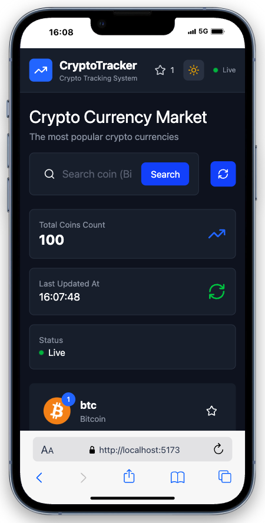
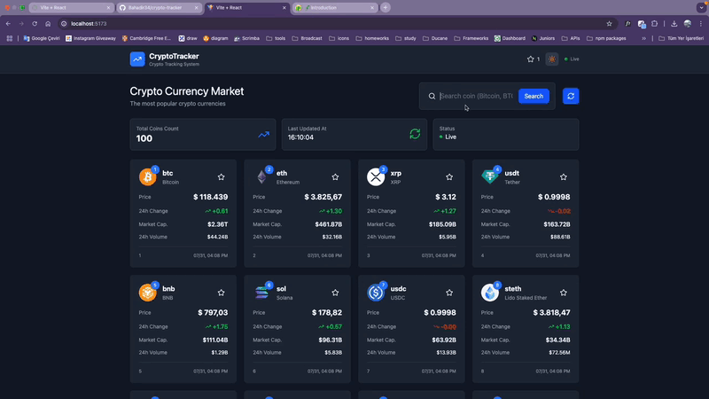

# CRYPTO-TRACKER

CRYPTO-TRACKER, kripto para piyasasını gerçek zamanlı olarak takip edebileceğiniz bir web uygulamasıdır. CoinGecko API kullanılarak geliştirilmiş bu proje, kullanıcıya güncel kripto para bilgilerini sunar. Projede dark-light mode seçimi özelliği de vardır.

## 🔗 Canlı API Kaynağı
[CoinGecko API v3.0.1](https://docs.coingecko.com/v3.0.1/reference/introduction)

## 🚀 Özellikler
- Gerçek zamanlı veri çekme
- Grafiklerle piyasa trendi takibi
- Arayüzde gezinme (SPA)
- Responsiveness (mobil uyumlu tasarım)

## 🛠️ Kullanılan Teknolojiler ve Kütüphaneler
- **React**
- **Tailwind CSS** – stil oluşturma
- **Axios** – HTTP istekleri
- **Chart.js** – grafik oluşturma
- **Lucide-react** – ikonlar
- **React Router DOM** – sayfalar arası gezinme


## 🖼️ Proje Önizlemesi





## 📁 Kurulum Talimatları

1. Bu repoyu klonlayın:
   ```bash
   git clone https://github.com/Bahadir34/CRYPTO-TRACKER.git
   cd CRYPTO-TRACKER